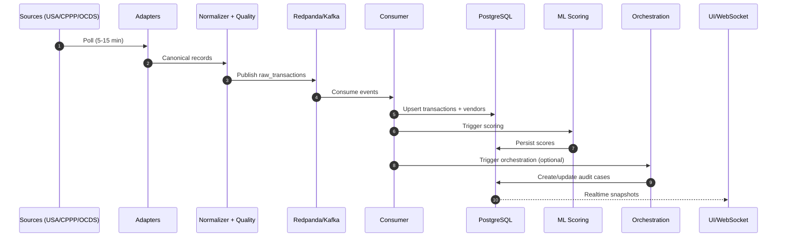

# Intelligent Procurement Audit & Anomaly Detection System

Enterprise-grade procurement intelligence platform for anomaly detection, AI-assisted triage, contract-aware forensic analysis, and measurable remediation outcomes.

## Executive Summary

This platform answers five operational questions:
- Which transactions are statistically anomalous?
- Which anomalies should be escalated for deeper legal/forensic review?
- Which contract clauses might be implicated?
- Which remediation actions should be tracked to closure?
- What financial impact has been recovered?

The design intentionally separates fast screening from deeper investigation:
- **Fast path**: scoring and case handling at scale.
- **Deep path**: richer AI/legal reasoning only when escalation is warranted.

This balances cost, speed, and evidence quality while preserving auditability.

## System Architecture

```mermaid
flowchart LR
   subgraph Sources
      USA[USAspending API]
      CPPP[India CPPP Portal]
      OCDS[OCDS JSONL Feed]
   end

   subgraph Ingestion
      A[Source Adapters]
      N[Canonical Normalization]
      Q[Data Quality + Dedup]
      C[Change Detection]
      K[Redpanda/Kafka]
   end

   subgraph Core Services
      CONS[Kafka Consumer]
      DB[(PostgreSQL)]
      ML[Isolation Forest + SHAP]
      ER[Entity Resolution]
      GE[Relationship Graph Engine]
      ORCH[AI Orchestration]
      RAG[RAG/FAISS]
   end

   subgraph API
      API[FastAPI]
   end

   subgraph Frontend
      UI[React Dashboard]
      WS[Realtime WebSocket]
   end

   USA --> A
   CPPP --> A
   OCDS --> A
   A --> N --> Q --> C --> K --> CONS
   CONS --> DB
   DB --> ML --> ORCH
   DB --> ER --> GE
   DB --> RAG --> ORCH
   ORCH --> DB
   DB --> API --> UI
   DB --> WS --> UI
```

## Data Flow (Near Real-Time)



## Architecture at a Glance

### Backend
- **Framework**: FastAPI
- **Database**: PostgreSQL (system of record)
- **Streaming backbone**: Redpanda/Kafka
- **ML**: Isolation Forest + SHAP + temporal/behavioral features
- **Entity resolution**: fuzzy vendor normalization
- **Graph risk**: relationship-based signals
- **Contract intelligence**: RAG over FAISS + sentence-transformers
- **AI orchestration**: Stage 1 triage, Stage 2 deep audit on escalation
- **Realtime UX feed**: WebSocket snapshot stream

### Frontend
- **Stack**: React + Vite + TypeScript
- **Data layer**: React Query + typed API client
- **Views**: Dashboard, Audit Inbox, Forensic Workspace, Smart CLM

## Multi-Source Procurement Ingestion

To avoid single-dataset bias and improve enterprise realism, ingestion supports multiple procurement ecosystems.

### Integrated source families
- **USAspending** (baseline structured federal data)
- **India CPPP** (semi-structured tenders)
- **Open Contracting / OCDS** (global standardized releases)

### Live source links/endpoints (connected)
- **USAspending API**: `https://api.usaspending.gov`
- **India CPPP active tenders**: `https://eprocure.gov.in/eprocure/app?page=FrontEndLatestActiveTenders&service=page`
- **OCDS JSONL feed (UK Contracts Finder)**: `https://data.open-contracting.org/en/publication/128/download?name=2026.jsonl.gz`

### Adapter framework (implemented)
`backend/ingestion/multi_source.py` includes:
- `class BaseIngestionAdapter`
   - `fetch()`
   - `normalize()`
- `class USASpendingAdapter`
- `class CPPPAdapter`
- `class OCDSAdapter`

This provides a stable extension point for adding future sources without rewriting downstream scoring or orchestration.

### Canonical normalization schema (implemented)
All adapters normalize into one canonical structure:

```json
{
   "transaction_id": "...",
   "buyer": "...",
   "vendor": "...",
   "amount": 0,
   "currency": "...",
   "timestamp": "...",
   "source": "CPPP | USA | OCDS"
}
```

### Data quality layer (implemented)
`backend/ingestion/data_quality.py` provides:
- missing-field fallback handling
- currency normalization (with USD conversion support)
- duplicate detection (transaction ID + fingerprint strategy)
- inconsistent naming cleanup for buyers/vendors

## Entity Resolution Layer

Vendor identity is treated as an intelligence problem, not a raw string field.

`backend/ml/entity_resolution.py` implements `class EntityResolver` with:
- vendor text normalization
- fuzzy matching (`SequenceMatcher` ratio)
- vendor clustering / canonical mapping

## Relationship Graph Engine

Row-level anomaly scoring is supplemented by network-level detection.

`backend/ml/relationship_graph_engine.py` implements `class RelationshipGraphEngine` with graph modeling:
- vendor <-> buyer
- vendor <-> vendor (shared buyer relationships)
- buyer <-> category

Detected signal families:
- repeated awards
- tight clusters
- unusual connections (centrality-based)

## Data Model (Core Entities)

- **Transaction**: canonical procurement record with source, amount, date, vendor
- **Vendor**: canonical vendor identity with normalized name
- **AuditCase**: audit outcome with ML score, LLM triage, and deep-audit results
- **ActionPlan**: remediation steps, owners, deadlines, ROI savings
- **Contract**: ingested CLM text chunks and vectorized embeddings

## API Surface

### Health
- `GET /api/v1/health`

### Scoring
- `POST /api/v1/score`
- `POST /api/v1/score/batch`

### Contracts / CLM
- `POST /api/v1/contracts/upload`
- `GET /api/v1/contracts`
- `GET /api/v1/contracts/{contract_id}`
- `GET /api/v1/contracts/search?q=...`
- `DELETE /api/v1/contracts/{contract_id}`

### Cases
- `GET /api/v1/cases`
- `GET /api/v1/cases/{case_id}`
- `PATCH /api/v1/cases/{case_id}/status`
- `PATCH /api/v1/cases/{case_id}/notes`

### Audit orchestration
- `POST /api/v1/audit/trigger/{transaction_id}`
- `POST /api/v1/orchestration/run`
- `GET /api/v1/orchestration/status`

### Action plans
- `POST /api/v1/cases/{case_id}/action-plan`
- `GET /api/v1/action-plans`
- `PATCH /api/v1/action-plans/{plan_id}/status`

### Metrics
- `GET /api/v1/metrics/roi`
- `GET /api/v1/metrics/coverage`
- `GET /api/v1/metrics/pipeline`
- `GET /api/v1/metrics/sources`

### Realtime
- `WS /api/v1/realtime/stream`

## Configuration (Key Environment Variables)

- `INGESTION_LOOP_ENABLED=true` to run pollers inside the API lifespan.
- `KAFKA_CONSUMER_ENABLED=true` to persist raw events into the DB.
- `INGESTION_POLL_INTERVAL_SECONDS=300` to tune poll cadence.
- `CPPP_BASE_URL`, `OCDS_BASE_URL` to override endpoints.
- `ORCH_RUN_LLM=true` to enable triage and deep-audit stage gating.

See `.env.example` for full configuration.

## Runbook

### 1) Start infrastructure
```powershell
docker-compose up -d
```

### 2) Start backend
```powershell
.\venv\Scripts\Activate.ps1
python -m alembic upgrade head
python -m uvicorn backend.api.main:app --reload --port 8000
```

### 3) Start frontend
```powershell
cd frontend
npm install
npm run dev
```

Open: `http://localhost:5173`

### 4) Optional: run ingestion as standalone
```powershell
python -m backend.ingestion.run_realtime_pipeline --interval 300 --limit 100
```

Single cycle mode:
```powershell
python -m backend.ingestion.run_realtime_pipeline --once --limit 100
```

### 5) Optional: force orchestration backfill
```powershell
Invoke-RestMethod -Method Post -Uri "http://127.0.0.1:8000/api/v1/orchestration/run" -ContentType "application/json" -Body '{"run_llm": true, "limit": 200}'
```

## Validation Checklist

1. Health endpoint returns OK.
2. Ingestion logs show source polling and Kafka publish counts.
3. `/api/v1/metrics/sources` returns multiple source families.
4. Cases populate with triage/deep-audit states.
5. Realtime timeline updates from WebSocket stream.

## Operational Notes

### Why coverage can appear tiny
If total transactions are high and audited subset is small, coverage can be mathematically tiny (for example `<0.01%`).

### Why ROI can remain zero
ROI stays zero until action plans are completed and realized savings are recorded.

### Why some forensic fields show pending/not-applicable
- **Pending**: triage/deep-audit has not completed yet.
- **Not applicable**: case did not escalate, so deep-audit fields are intentionally absent.

## Current Constraints

- CPPP page structure can change over time; adapter includes HTML fallback but may require selector refreshes when the portal updates markup.
- Some OCDS feeds are large; JSONL gzip ingestion is optimized for streaming but still subject to upstream throttling.
- Realtime transport remains snapshot-style websocket updates, not full CDC/event sourcing.
- RBAC/SSO/approval controls are future hardening tracks.

## Recommended Next Increments

1. Persist canonical source confidence and quality flags per record.
2. Add graph-risk scores directly into case prioritization.
3. Add per-source freshness SLAs and ingestion lag dashboards.
4. Add role-based workflow and approval gates for case closure.
